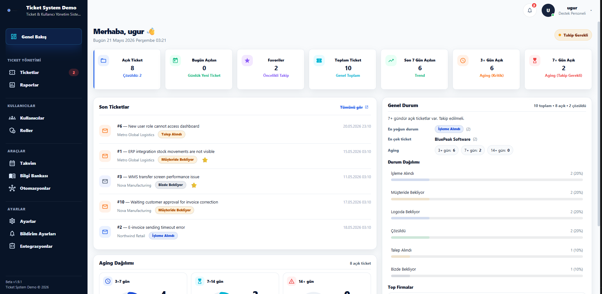
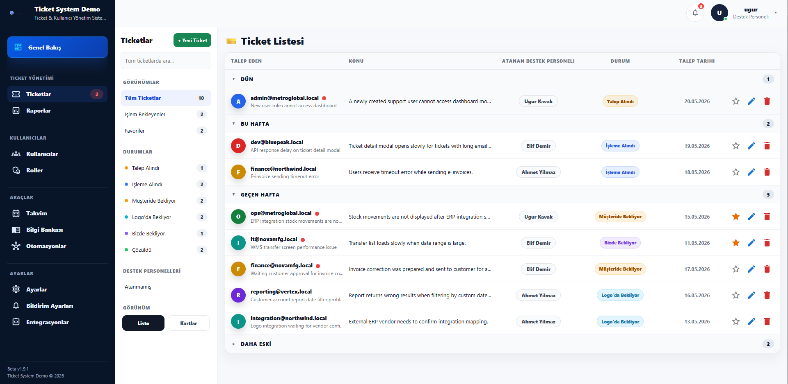
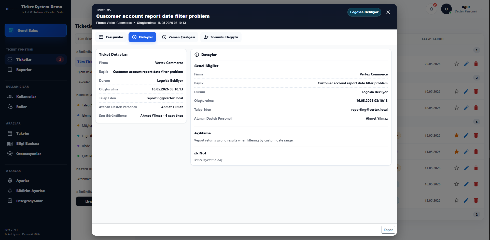
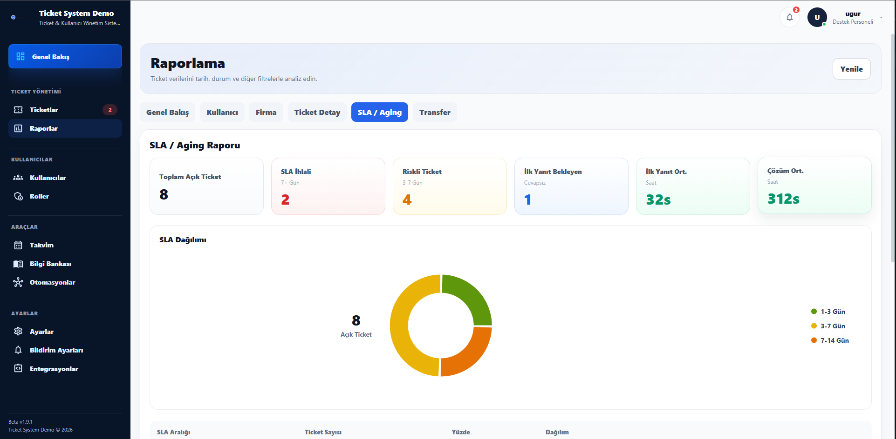

# Ticket Support Management System

A full-stack ticket and support management platform built with **React.js**, **ASP.NET Core**, **MSSQL**, and **JWT Authentication**.

This project is a public portfolio demo version of a real-world internal support workflow system.
It demonstrates ticket lifecycle management, email-based ticket creation, activity tracking, transfer history, reporting dashboards, and role-based authentication.

---

# Features

## Ticket Management

* Create, update, assign, and resolve tickets
* Ticket status lifecycle management
* Favorite tickets
* Filtering & search
* Ticket detail modal
* Real-time unread tracking logic

## Email-Based Workflow

* Email → Ticket ingestion flow
* Thread-based email tracking
* Automatic ticket creation from incoming emails
* Outbound reply support
* Auto-reply & acknowledgement system
* Mail activity logging

## Activity & Audit System

* Ticket activity timeline
* Status change history
* Assignment transfer history
* User-based action tracking
* Internal notes & updates

## Dashboard & Reporting

* Dashboard summary cards
* Ticket aging analysis
* Status distribution
* User performance reports
* Company-based reporting
* Recent activity tracking

## User & Role Management

* JWT authentication
* Role-based authorization
* Support personnel management
* Ticket ownership system

## UI / UX

* Responsive layout
* Modern dashboard interface
* Sidebar navigation
* Ticket list & detail views
* Status badges & indicators

---

# Tech Stack

## Frontend

* React.js
* Vite
* JavaScript
* Bootstrap
* Axios

## Backend

* ASP.NET Core Web API
* Entity Framework Core
* MSSQL Server
* AutoMapper
* JWT Authentication

## Architecture

* Layered Architecture
* DTO-based structure
* Repository Pattern
* Service Layer
* RESTful API design

---

# Project Structure

```bash
ticket-support-management-system
│
├── cmd-portal-frontend
├── cmd-portal-ticket-api
└── cmd-portal-auth-api
```

---

# Screenshots

## Dashboard


## Ticket List


## Ticket Detail


## Reports


---

# Demo Database Setup

Run the following SQL script in SQL Server Management Studio:

```sql
database/setup-demo-database.sql
```

This script automatically creates:

- TicketSystemAuthDemoDb
- TicketSystemDemoDb
- Demo authentication user
- Demo support users
- Demo tickets
- Demo activity history
- Demo transfer logs
- Demo email thread records

## Demo Login

```text
Username: demo
Password: Demo123!
```

# Setup

## 1. Clone Repository

```bash
git clone https://github.com/UgurKAVAK/ticket-support-management-system.git
```

---

## 2. Configure MSSQL Connection Strings

Update appsettings.json files:

```json
"ConnectionStrings": {
  "sqlServerConnection": "Server=localhost;Database=TicketSystemDemoDb;Trusted_Connection=True;TrustServerCertificate=True;"
}
```

If your SQL Server instance is different, update:

- localhost
- .\SQLEXPRESS
- (localdb)\MSSQLLocalDB

---

## 3. Run Demo Database Script

Execute:

```sql
database/setup-demo-database.sql
```

---

## 4. Run Backend APIs

```bash
dotnet run
```

---

## 5. Run Frontend

```bash
npm install
npm run dev
```

---

# Security Notes

This repository is a public portfolio demo version.

* All company-specific branding was removed
* Real domains/emails were replaced with demo placeholders
* SMTP/IMAP credentials were sanitized
* JWT/connection string values were replaced with demo-safe values
* No real customer data exists in this repository

---

# Future Improvements

* Docker support
* SignalR real-time notifications
* Redis caching
* Advanced SLA tracking
* Email template management
* Multi-tenant architecture
* CI/CD pipeline integration

---

# Author

**Uğur KAVAK**

Full-Stack Developer
React.js • .NET • MSSQL

GitHub: https://github.com/UgurKAVAK
